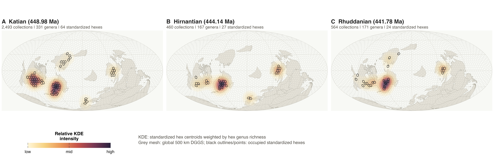

# LOME Brachiopod AI Workflow

**A public demonstration package for a RAG-Skill-Agent workflow in deep-time paleobiogeography**

This repository documents a workflow design for studying global brachiopod paleobiogeographic change across the Late Ordovician mass extinction (LOME). It is not a complete release of the associated unpublished research project. Instead, it provides a public-safe demonstration of how literature retrieval, structured paleobiological databases, reusable computational Skills, multi-agent coordination, human review, and intermediate outputs can be organized into an auditable research workflow.

The central idea is simple: in paleobiology, artificial intelligence should not flatten fossil records into undifferentiated text. Literature, fossil occurrences, taxonomy, stratigraphy, paleogeography, sampling diagnostics, and expert review all have different structures. This repository therefore separates the workflow into three connected layers:

- **RAG**: retrieves and summarizes literature evidence with citation-level traceability.
- **Skills**: execute bounded computational tasks such as PBDB/GBDB import, taxonomic cleaning, stratigraphic binning, paleogeographic reconstruction, diversity estimation, PyRate-style diagnostics, and figure generation.
- **Agents**: coordinate, review, and route tasks across the workflow while preserving human expert veto points.

The package is designed to accompany a manuscript case study on AI-assisted paleobiological research. It can also serve as a reference model for building similar workflows in other deep-time research problems.



## What This Repository Contains

| Folder | Purpose |
|---|---|
| `agents/` | Role definitions for the coordinator, literature RAG, database, taxonomy, stratigraphy, paleogeography, diversity, figure, review, and human-review components. |
| `skills/` | Skill specifications with instructions, trigger conditions, quality standards, examples, and lightweight wrapper code. |
| `rag/` | Public-safe RAG layer containing knowledge cards, retrieval prompts, query banks, schemas, demo chunks, and curated bibliography files. |
| `data/` | Small public-demo raw PBDB and GBDB-style input tables. These are not the final curated research datasets. |
| `results/` | Small intermediate numerical outputs that illustrate quality-control, spatial, environmental, and PyRate-related diagnostics. |
| `figures/` | Ten PNG figures selected from intermediate workflow outputs. These are demonstration figures, not final publication figures. |
| `runs/` | Five sanitized run records showing how human review and workflow revision can be documented. |

## Workflow Overview

The workflow starts from a human-defined scientific question:

> How did global brachiopod paleobiogeographic patterns change across the LOME and its aftermath?

The system does not attempt to discover this question automatically. In the current state of paleobiology, automatic question discovery remains difficult because the fossil record is incomplete, unevenly sampled, stratigraphically structured, and strongly dependent on expert taxonomic and geological judgement. The workflow therefore treats AI as a structured research assistant rather than an autonomous substitute for the researcher.

The default execution logic is:

1. Define the question and scope.
2. Retrieve literature evidence through the RAG layer.
3. Import raw public database records and authorized local data.
4. Clean taxonomy and flag unresolved names.
5. Align stratigraphic bins and age ranges.
6. Reconstruct paleogeographic coordinates and spatial units.
7. Estimate diversity and sampling-aware background dynamics.
8. Run adversarial review on sampling, taxonomy, stratigraphy, and model assumptions.
9. Generate diagnostic figures from approved intermediate outputs.
10. Preserve run logs, review decisions, and unresolved issues.

The architecture is summarized in `workflow_manifest.yaml`.

## Public Demo Scope

This repository is deliberately limited. It demonstrates the workflow structure but does not expose unpublished core results.

Included:

- public-demo PBDB and GBDB-style raw input tables;
- RAG knowledge cards and citation metadata;
- Skill and Agent specifications;
- small intermediate diagnostic outputs;
- selected non-final demonstration figures;
- sanitized run records showing review and revision loops.

Not included:

- final expert-curated occurrence tables;
- local synonymy and stratigraphic correction files;
- complete PyRate-ready taxon input files;
- full PyRate logs;
- final publication figures and editable source panels;
- unpublished final interpretations;
- full-text copyrighted PDFs or manuscript copies.

Final analytical data products and publication-ready figures are intended to be released after the associated paper is published.

## RAG Layer

The `rag/` folder is designed for copyright-safe retrieval. It does not store full papers. Instead, it provides:

- curated citation metadata;
- references requiring manual verification;
- short knowledge cards;
- public-safe demonstration chunks;
- retrieval questions;
- schemas for evidence records and chunk metadata;
- operational instructions for a retrieval agent.

The default RAG index should include `knowledge_cards/`, `demo_chunks/`, `query_bank/`, and `bibliography/core_references.csv`. It should not index `bibliography/needs_verification.csv` as factual evidence.

## Skill Layer

Each Skill is a bounded operation with:

- instructions;
- trigger conditions;
- quality standards;
- examples;
- lightweight wrapper or pseudo-wrapper code.

The public Skill folders are interface contracts rather than a full copy of the ongoing research codebase. Some Skills are designed to call authorized local scripts or private datasets during full internal execution. Those private resources are intentionally not copied into this repository.

## Agent Layer

Agents are defined as workflow roles, not as unconstrained autonomous systems. A valid run should make visible:

- which Agent was invoked;
- which Skill was called;
- what input files were used;
- what output files were produced;
- what review questions were raised;
- where human expert decisions changed the workflow.

The review agent and human-review protocol are central. They are responsible for checking whether an apparent pattern could arise from sampling unevenness, synonymy, stratigraphic binning, paleogeographic model choice, or over-interpretation of intermediate outputs.

## Reproducibility

Create the demonstration environment with:

```bash
conda env create -f environment.yml
conda activate lome-brachiopod-ai
```

This environment is intended for inspecting metadata, validating JSON/CSV files, and running lightweight demonstration scripts. Full execution of the unpublished research pipeline may require additional local data, external geodynamic tools, R scripts, and PyRate installations that are not bundled here.

Recommended first checks:

```bash
python -m json.tool rag/schemas/evidence_record_schema.json
python -m json.tool rag/schemas/chunk_metadata_schema.json
```

## Data and Copyright

Please read `DATA_AND_COPYRIGHT.md` before reusing the repository. The short version is:

- do not treat demo files as the complete scientific dataset;
- do not add full-text copyrighted papers to the public repository;
- do not interpret intermediate figures as final published conclusions.

## Suggested Citation

Until the associated paper is published, cite this repository as a workflow demonstration package rather than as a final data release. A formal citation record can be added after publication or DOI deposition.
